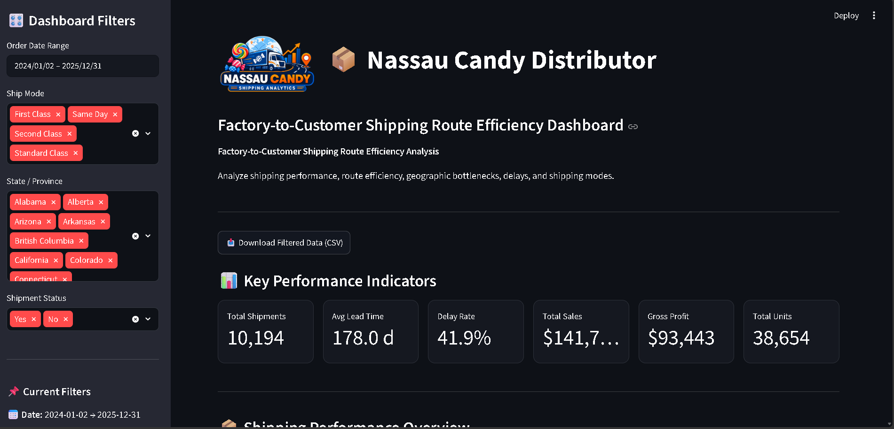

# 🚚 Nassau Candy Shipping Analytics Dashboard




## 📌 Project Overview

The Nassau Candy Shipping Analytics Dashboard is an interactive Business Intelligence dashboard developed using Streamlit, Python, Pandas, and Plotly.

The dashboard analyzes factory-to-customer shipping operations, helping identify route efficiency, shipping delays, factory performance, geographic bottlenecks, and shipping mode effectiveness through interactive visualizations and KPIs.

---

## 🎯 Objectives

- Analyze shipment performance across factories and states.
- Identify high-risk shipping routes.
- Compare shipping modes based on lead time and delay rate.
- Detect geographic bottlenecks affecting deliveries.
- Support operational decision-making through data visualization.

---

## 📊 Dashboard Features

### 📌 Interactive Filters

- Order Date Range
- Ship Mode
- State / Province
- Shipment Status (Delayed / On Time)

---

### 📈 Key Performance Indicators (KPIs)

- Total Shipments
- Average Shipping Lead Time
- Delay Rate
- Total Sales
- Gross Profit
- Total Units

---

### 🏭 Factory Performance Analysis

- Shipment Volume by Factory
- Average Lead Time by Factory
- Factory Delay Rate
- Factory Performance Summary

---

### 🚚 Route Efficiency Analysis

- Route Efficiency Score
- Top 10 Efficient Routes
- Bottom 10 Inefficient Routes
- Route Leaderboard
- Operational Risk Analysis
- Highest Risk Routes

---

### 🌍 Geographic Analysis

- US Shipment Distribution Map
- US Delay Rate Map
- State-wise Shipment Volume
- Average Lead Time by State
- Geographic Bottleneck Detection

---

### 🚛 Shipping Mode Analysis

- Fastest Shipping Mode
- Lowest Delay Rate
- Shipment Distribution
- Lead Time vs Delay Trade-off
- Ship Mode Performance Summary

---

### 🔎 Route Drill-Down

- Detailed Route Analysis
- Route Rank
- Route Performance Badge
- Order-Level Shipment Details

---

### 📌 Executive Summary

- Overall Business Performance
- Best Performing Route
- Highest Risk Route
- Operational Priorities
- Executive Insights

---

## 🛠️ Tech Stack

- Python
- Streamlit
- Pandas
- Plotly
- NumPy

---

## 📂 Dataset

The dashboard uses the **Nassau Candy Distributor Shipping Dataset**, containing more than **10,000 shipment records** with information about:

- Factory
- Customer Location
- Shipping Mode
- Shipping Lead Time
- Sales
- Gross Profit
- Shipment Delay
- Order & Ship Dates

---

## 🚀 Installation

Clone the repository

```bash
git clone https://github.com/aryanmat07-coder/Nassau-Candy-Shipping-Analytics.git
```

Move into the project directory

```bash
cd Nassau-Candy-Shipping-Analytics
```

Install dependencies

```bash
pip install -r requirements.txt
```

Run the dashboard

```bash
streamlit run app.py
```

---

## 📸 Dashboard Preview


---

## 📈 Future Improvements

- Predict shipment delays using Machine Learning
- Route optimization using AI
- Live shipment tracking
- SQL database integration
- Real-time business dashboard
- Automated report generation

---

## 👨‍💻 Developer

**Shivansh Mathur**

B.Tech Artificial Intelligence & Machine Learning

Vivekananda Global University, Jaipur

GitHub:
https://github.com/aryanmat07-coder

LinkedIn:
https://www.linkedin.com/in/shivansh-mathur/

---

## ⭐ If you found this project useful, consider giving it a Star.